Создаём связь между виртуальными машинами

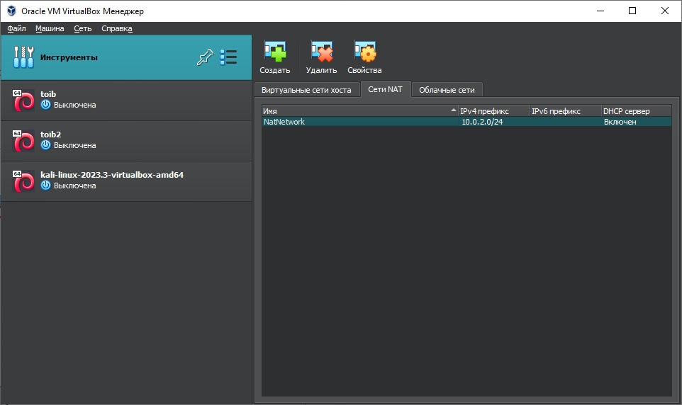
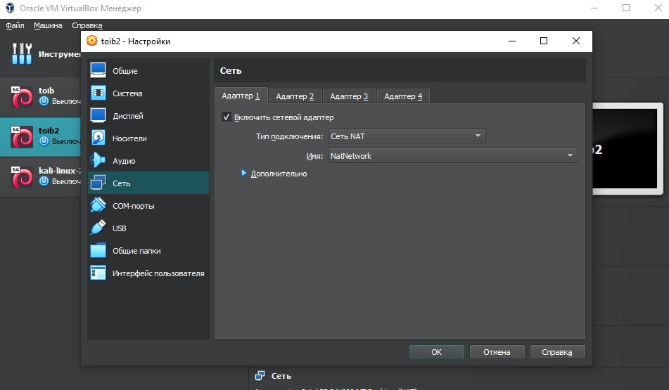
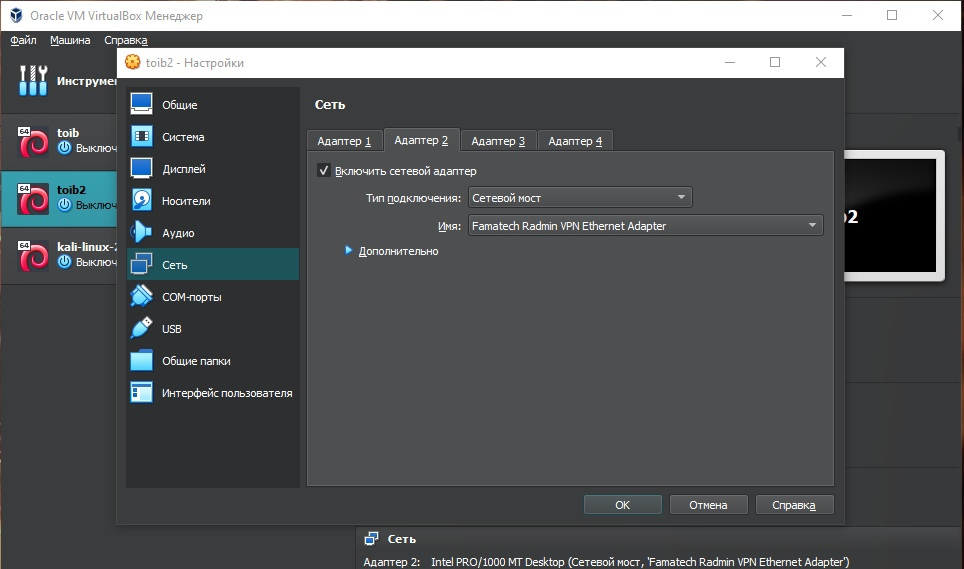

Запускаем keycloak

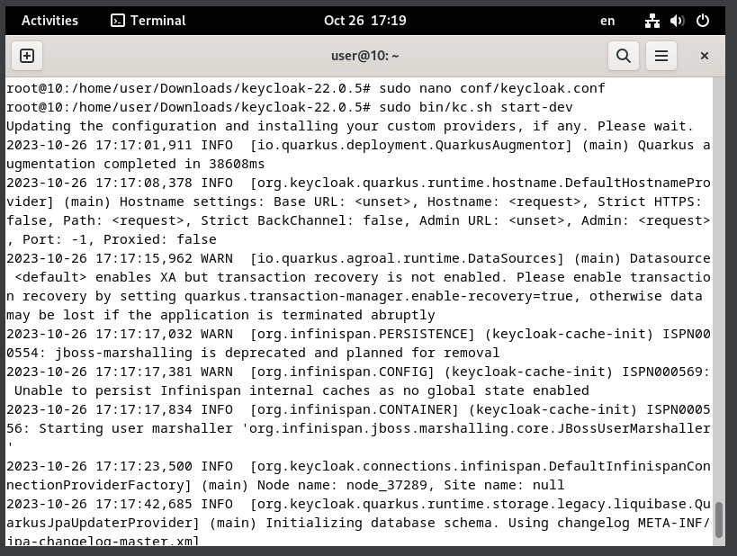

Создаём аккаунт админа

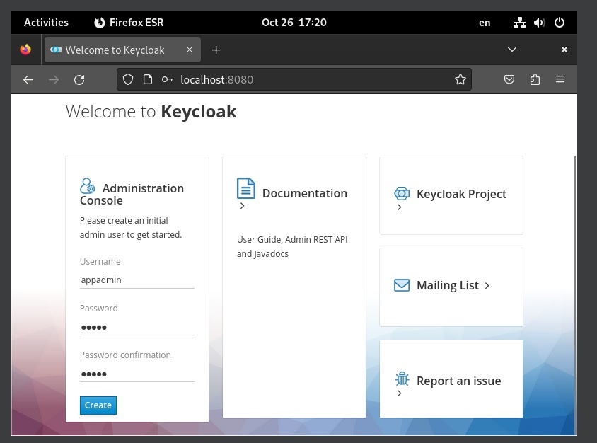

Создаём новый realm

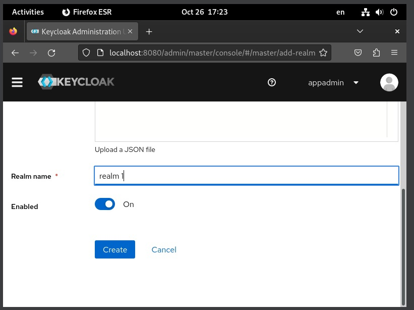

Добавляем пользователей

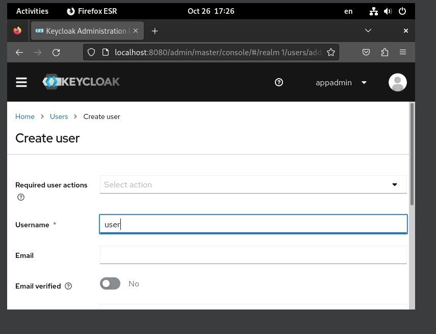
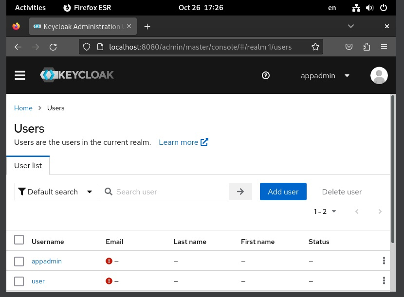

Создаём клиент

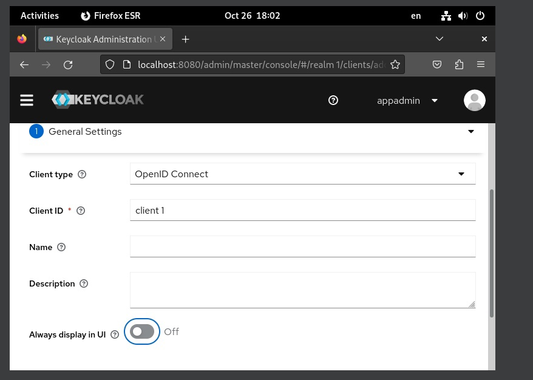

Запускаем nextcloud

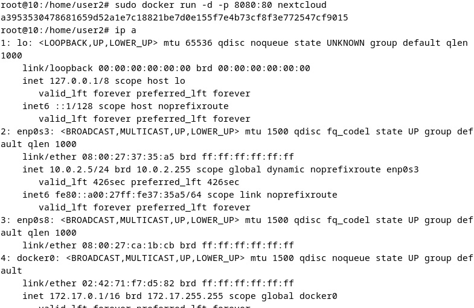
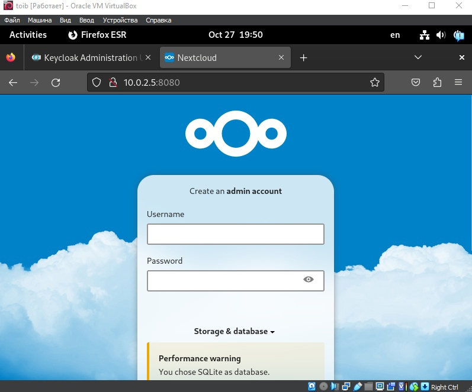

Добавляем nextcloud в клиент

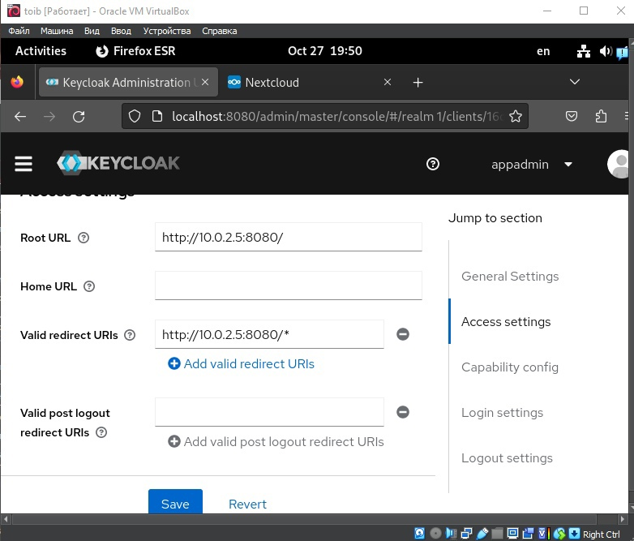

Авторизация через keycloak

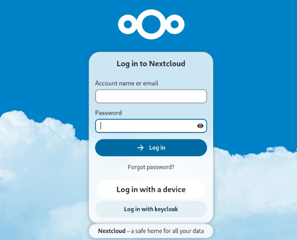

Настраиваем авторизацию OTP

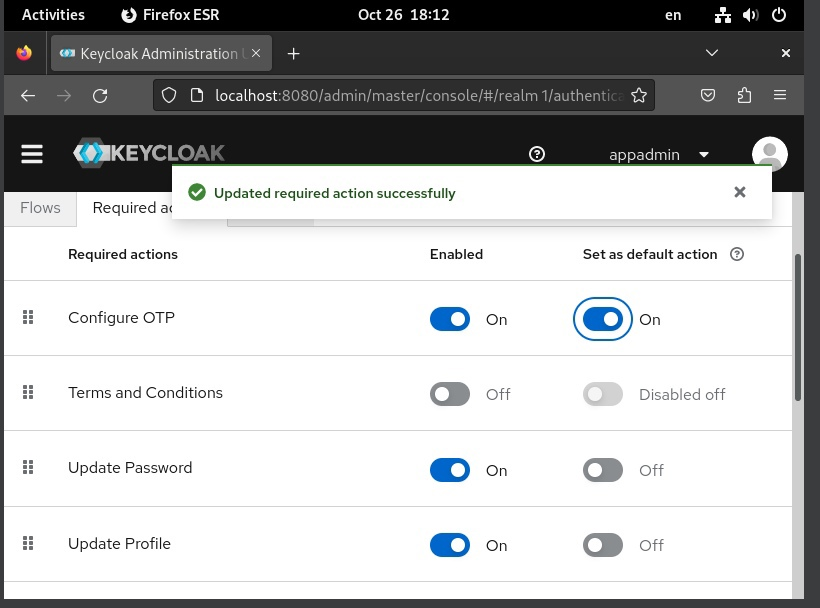
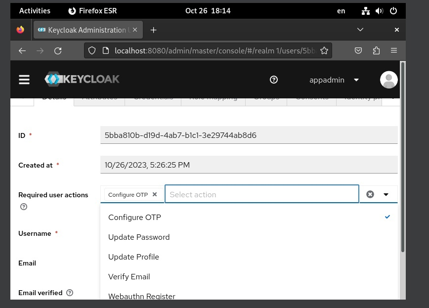
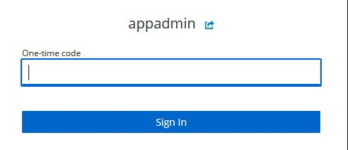
